<h1>Next.js + Nest.js + Solidity Full-Stack Web3.0 Shop 2024</h1>

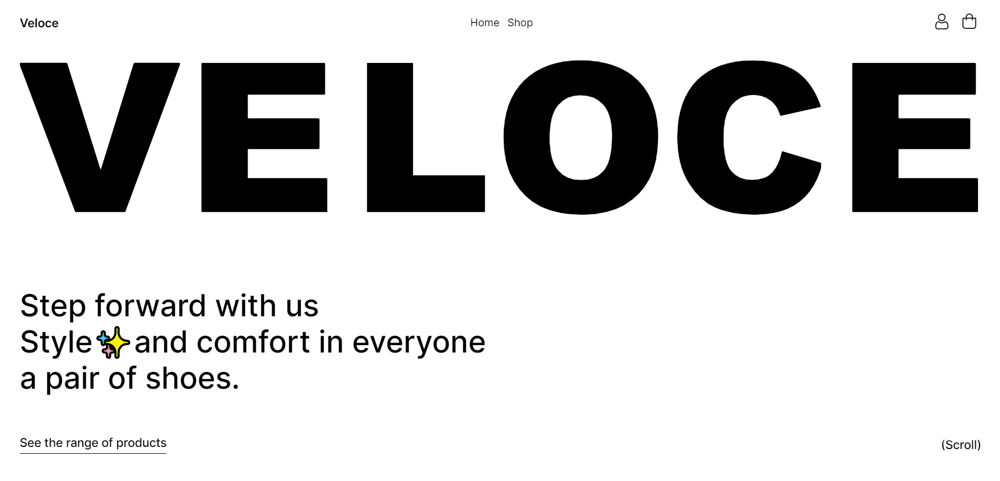

## Technology Stack

> Client

<ul>
  <li>▶️ Next.js</li>
  <li>🌟 Framer-motion</li>
  <li>✨ React-hook-form</li>
  <li>⚡️ Recoil</li>
  <li>🔍 Axios</li>
  <li>💎 Zod</li>
</ul>

> Server

<ul>
  <li>😸 Nest.js</li>
  <li>🔑 JWT</li>
  <li>💾 MongoDB</li>
  <li>📣 Mongoose</li>
</ul>

> Blockchain

<ul>
  <li>🏦 Solidity</li>
  <li>💱 Ethers.js (v6+)</li>
  <li>👷 Hardhat</li>
</ul>

> Testing

<ul>
  <li>✅ Cypress</li>
</ul>

## Site Functional

<ul>
  <li>Purchase of goods</li>
  <li>Give a product a rating/comment</li>
  <li>Delete your comment/rating</li>
  <li>Add products to your favorite list</li>
  <li>Remove products from your likes list</li>
  <li>Select product configuration</li>
  <li>Search products by filters</li>
  <li>Search products by filters: gender, color, size, collections</li>
  <li>Filter product feed by date, price</li>
  <li>Load products when scrolling</li>
  <li>Registration, authorization</li>
  <li>Changing, filling out the profile with personal data for automatic loading when paying</li>
  <li>(Admin) Add new products</li>
  <li>View/delete added items to cart</li>
  <li>Use promotional codes</li>
  <li>Payment for products using a smart contract</li>
  <li>Payment upon receipt by mail</li>
    <li>View 6 newest products</li>
  <li>(Admin) View, interact with products delivery</li>
</ul>

## Pages

<b>Home page</b>


<b>Shop page</b>


<b>Product page</b>
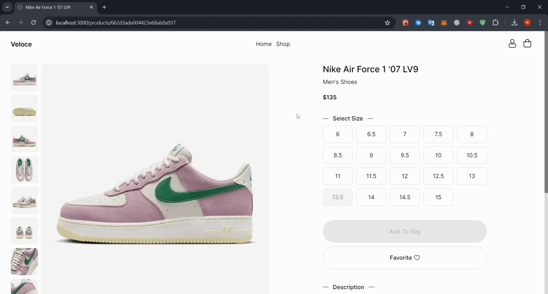

<b>Profile page</b>


<b>Pay page</b>
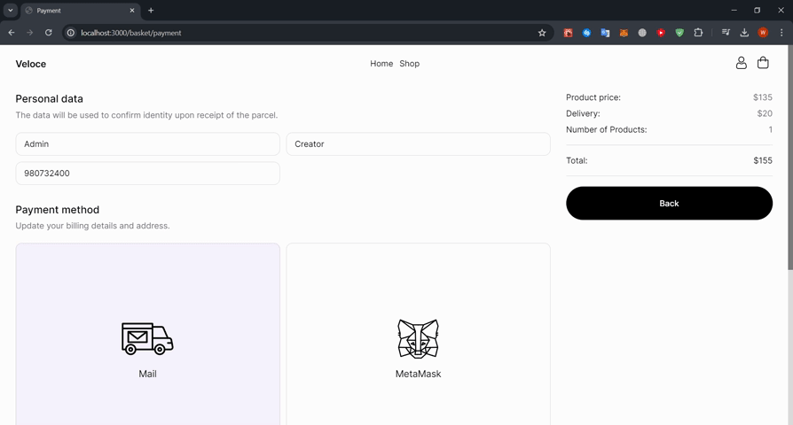

## Getting Started

You can just fork or clone this repository and use it as is.

✨ It just works. ✨

**_Step 1 Start_**
Let's start by installing dependencies using the command

```js
npm i
```

Now let's start the client, server

```js
// client
cd client
npm run dev

// server
cd server
npm run start:dev

// hardhat
cd client
npx hardhat node
```
<p>You can see that after the command "npx hardhat node" you have a JSON-RPC url displayed, copy it, we will need it soon</p>


**_Step 2 MetaMask_**

install the extension for your browser by clicking <a href="https://chromewebstore.google.com/detail/metamask/nkbihfbeogaeaoehlefnkodbefgpgknn?hl=ru&pli=1">HERE</a>

Now register with MetaMask

After installation, an extension with the MetaMask logo should appear in the upper right corner of your browser, click on it and follow the actions on the cards

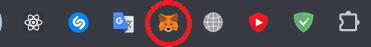
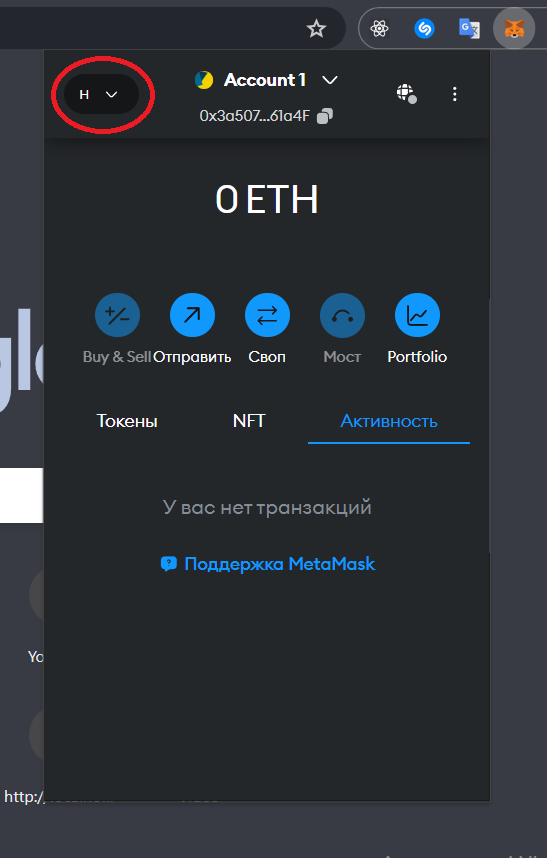
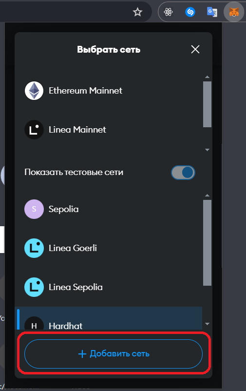
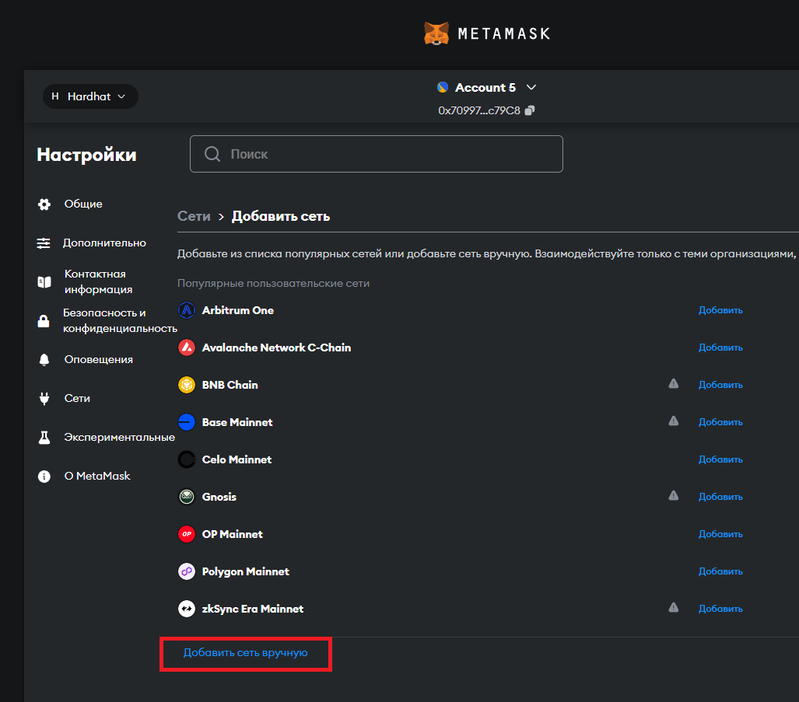
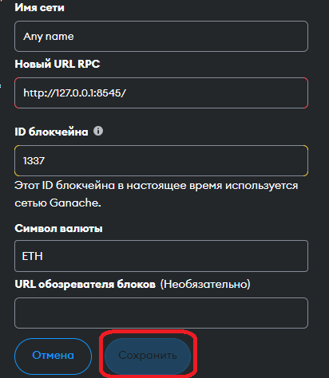
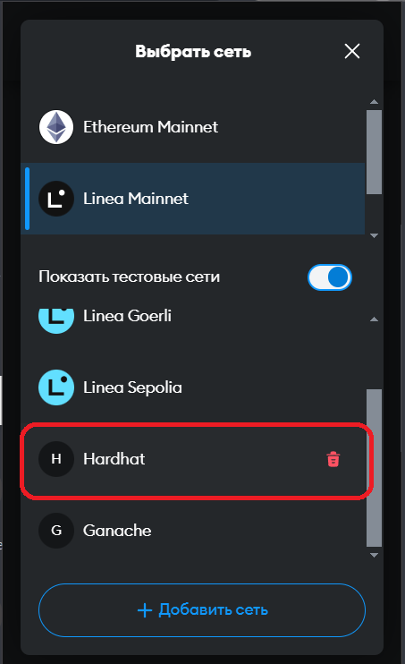

Now let's get a test currency

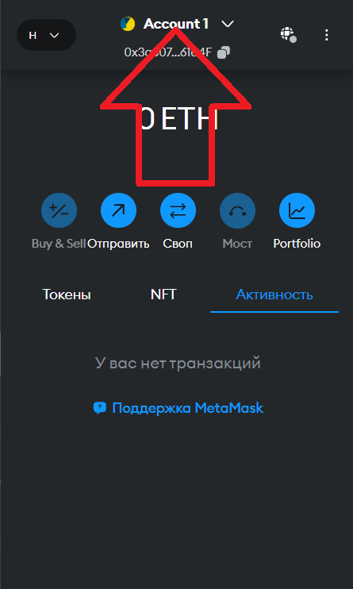
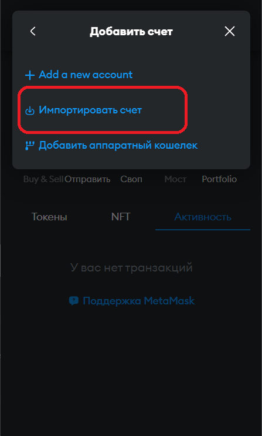

Copy any private key

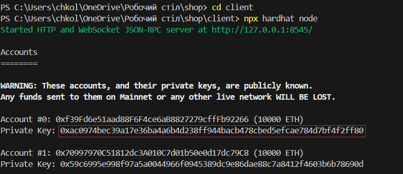
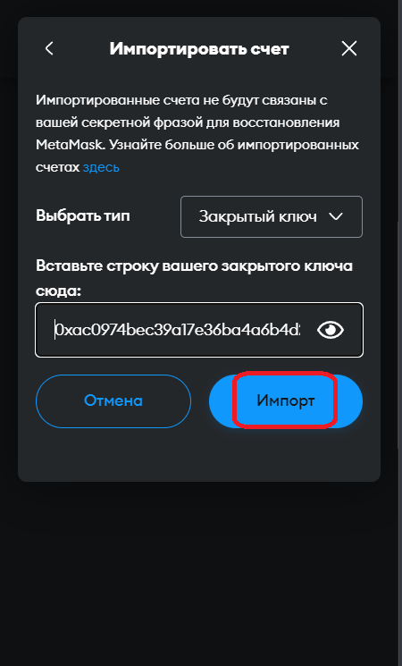

Everything is ready, our balance is 10,000 ETH

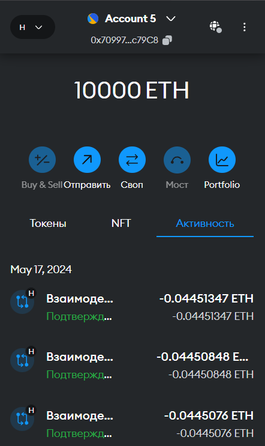

## Config

Create a .env file on the server and add 2 variable names to it whose names must be strictly observed
```js
DB_LINK = //Your link to mongoDB
JWT_SECRET_KEY = // Any key, for example 123456 (Do not use for real projects because it is very simple, use a password generator)
```